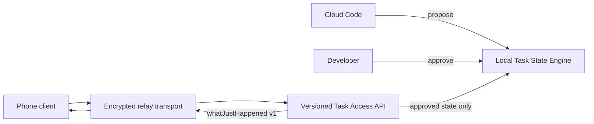

# SyncLined heartbeat milestone

The local Task State Engine is authoritative. Every client reads approved state through the versioned Task Access API; transports only forward requests.

## Public heartbeat contract

`whatJustHappened(taskId, schemaVersion, actor)` returns a permission-scoped summary with the current goal and recently confirmed changes. The initial schema version is `v1`.

The `TaskTransport` interface separates delivery from the contract. `LoopbackRelay` is the demo transport; it carries no task state and does not confirm proposals.

## Demo

Run `cargo test --test relay_heartbeat` to demonstrate: propose, approve, then retrieve the versioned heartbeat through the relay-backed API.
