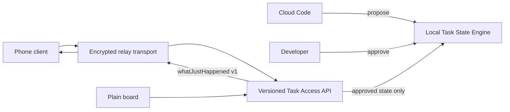

# SyncLined core

SyncLined is a local-first task state engine backed by SQLite. Agents propose typed records, people review them, and clients read only approved state through the versioned Task Access API.

## Quick start

Install a stable [Rust toolchain](https://www.rust-lang.org/tools/install), then run the included in-memory example:

```sh
cd outputs/synclined
cargo run --example quick_start
```

Expected output:

```text
SyncLined quick start
schema: v1
goal: Ship a reviewed task state
approved: Use the versioned Task Access API
```

The example creates a task, submits a decision through `TaskAccessApi`, accepts it, and reads the approved heartbeat. It uses SQLite's in-memory mode and does not create a database file.

Run the complete test suite with:

```sh
cargo test
```

## Architecture

The local Task State Engine is authoritative. Every client reads approved state through the versioned Task Access API; transports only forward requests.



## Public heartbeat contract

`whatJustHappened(taskId, schemaVersion, actor)` returns a permission-scoped summary with the current goal and recently confirmed changes. The initial schema version is `v1`.

The `TaskTransport` interface separates delivery from the contract. `LoopbackRelay` is the demo transport; it carries no task state and does not confirm proposals.

## Plain board contract

The board is an API client, not an engine client. It shows the current goal and immutable pending proposals. Its accept, reject, and edit-then-accept actions are routed through `TaskAccessApi`; it holds no parallel task state.

## Additional demo

Run `cargo test --test relay_heartbeat` to demonstrate: propose, approve, then retrieve the versioned heartbeat through the relay-backed API.
